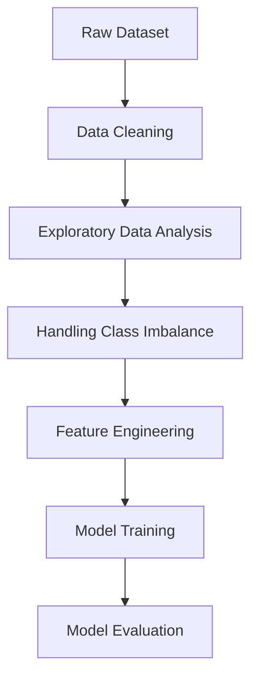

# Indonesian Credit Scoring Model

End-to-end machine learning pipeline for predicting loan default risk using Indonesian credit data.  
This project automates the process of data preprocessing, exploratory analysis, handling class imbalance, and model training for credit risk prediction.

The pipeline is designed to be reproducible and structured, making it suitable for financial analytics, risk assessment, and machine learning applications.

# Project Overview
Credit risk analysis is a crucial component in financial institutions to minimize losses and improve lending decisions. However, real-world credit data often contains challenges such as missing values and class imbalance.

This project builds a machine learning pipeline to predict whether a customer will default on a loan.

The pipeline performs the following tasks:
1. Load and clean the dataset
2. Perform exploratory data analysis (EDA)
3. Handle class imbalance
4. Prepare features for modeling
5. Train and evaluate machine learning models

The resulting model can be used for:
- Credit risk prediction
- Loan approval decision support
- Financial risk management
- Machine learning experimentation

# Pipeline Architecture
The machine learning workflow is structured as follows:



# Exploratory Data Analysis
Key analyses include:
- Target distribution (paid off, defaulted)
- Feature distributions
- Identification of data imbalance

Key insight:
- The dataset shows significant class imbalance, which requires special handling to avoid biased models.

# Handling Class Imbalance

Since the number of non-default customers dominates the dataset, techniques are applied to balance the data.

Approaches include:
- Model-aware evaluation metrics

# Feature Engineering
Features are prepared to improve model performance.
This includes:
- Encoding categorical variables
- Selecting relevant features
- Structuring input data for machine learning models

# Model Training
Machine learning models are trained to classify customers into:
0 → Non-default
1 → Default

Models used:
- LightGBM
- Optuna for hypertuning model
 
# Model Evaluation
Model performance is evaluated with consideration of class imbalance.

Important metrics include:
- Accuracy
- Precision
- Recall
- F1-Score
Special focus is given to Recall for default class, as detecting risky customers is more important than overall accuracy.

# Tech Stack
- Python
- Pandas
- NumPy
- Scikit-learn
- Matplotlib
- Seaborn

# Potential Applications
The model developed in this project can be used for:

- Credit scoring systems
- Risk assessment tools
- Loan approval automation
- Financial data science research

# Running the Project
1. Download the repository
2. Place the dataset file inside the data/ folder
3. Open the notebook:
``` notebooks/IndonesianCreditScore.ipynb ```
4. Run using Jupyter Notebook or Google Colab

# Author
Yan Andhinaya Ardika
